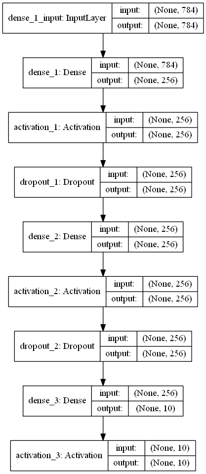

# ExTensorflow
Tensorflow 공부해보자

# 설치
설치 참고 사이트
- https://sdc-james.gitbook.io/onebook/
- https://pythonkim.tistory.com/137
- https://twinstarinfo.blogspot.com/2018/12/tensorflow-gpu-install-nvidia-cuda.html

## 1. Anaconda 설치
- 아나콘다는 ~

## 2. Tensorflow 설치
- 유명한 오픈 소스 딥러닝 라이브러리인 텐서플로(Tensorflow)는 고차원 API로 케라스를 사용한다. 즉, 사용자는 텐서플로 위에 케라스를 얹어 딥러닝을 구현할 수 있다. 
- 텐서플로 2.0부터는 Keras를 사용하길 권장한다.

## 3. Keras 설치
- 케라스는 ~

### 필수 라이브러리 설치
#### pydot (GraphViz)
케라스 모델의 각 계층 사이의 연결과 입출력을 그래프로 보여준다.

##### 설치
1. GraphViz 홈페이지([https://graphviz.gitlab.io/](https://graphviz.gitlab.io/_pages/Download/Download_windows.html))에 들어간다.
2. graphviz-2.39.msi를 다운로드 한다.
3. **제어판 > 시스템 및 보안 > 시스템 > 고급 시스템 설정 > 환경 변수**로 들어간다.
4. \[시스템 변수\]에 변수이름 : **GRAPHVIZ_DOT** / 변수 값 : **"C:\Program Files (x86)\Graphviz2.38\bin\dot.exe"** 추가
5. \[시스템 변수\] 중 Path **편집 > 새로 만들기**을 누르고, 변수 값 : **"C:\Program Files (x86)\Graphviz2.38\bin"** 추가

##### 사용
```python
from keras.utils import plot_model

plot_model(model_name, to_file=export_image_name, show_shapes=True/False)
# show_shapes=Flase : 각 계층의 명칭과 속성만 표시 / True : 입력값 출력값 정보도 함께 표시 

# 사용 예
plot_model(model, to_file='mlp-mnist.png', show_shapes=True)
```

##### 결과


##### 오류
GraphViz를 설치했음에도 다음과 같은 오류가 뜨는 경우가 있다.
> - ImportError: Failed to import 'pydot'. ~
> - GraphViz’s executables not found. ~
> - Failed to import pydot. You must install pydot and graphviz for pydotprint to work. ~

이런 경우에는 두 가지를 확인하자.
- 시스템 변수를 제대로 설정하지 못한 경우
    - 실제 설치 된 경로를 확인하고, 시스템 변수 경로를 다시 수정하자.
- conda에 설치를 하지 않은 경우
    - ```bash
      $ conda install dydot-ng
      $ conda install graphviz
      ```
    - 위 코드를 입력해서 설치하자.
    

## 4. PyCharm 설치
- Python 작성 툴은 굉장히 많다. 이 중 Visual Code와 함께 PyCharm은 Python Code 작성의 대표적인 툴이다.
- 만약 자신이 별다른 기능을 사용하지 않을 것 같다고 하면 Visual Code를 사용해도 좋다.
- PyCharm은 Python에 특성화 되어 있고 많은 편의기능을 제공하니 사용해봐도 좋을 것 같다.

---

# Tensorflow
공부하는 방법...

---
 
# Keras
## 참고자료
이 글의 내용은 개인 학습용으로 작성한 것이며, 학습 이외의 다른 용도로 사용하지 않습니다.
1. <김태영의 케라스 블로그> : https://tykimos.github.io/index.html
    - 딥러닝 및 데이터셋 개념, 전반적인 학습 과정 및 기본 모델 구성에 대해 학습합니다.
2. <케라스로 구현하는 고급 딥러닝 알고리즘> 로웰 아티엔자 지음. 김정인 옮김. 위키북스 출판.
    - 위 책을 통해. 각종 딥러닝 기법, 오토인코더, GAN, 변분 오토인코더, 심층강화학습, 정책 경사 기법 적용 등을 학습합니다.

## What is the Keras?
케라스는 모델을 효율적으로 구축하고 훈련시킬 수 있게 하는 딥러닝 라이브러리이다.
##### 장점
- 계층이 레고 블록처럼 서로 연결돼 있어 모델을 깔끔하고 이해하기 쉽게 구현하기 좋다.
- 딥러닝 모델을 상당히 적은 코드로 구현 가능 → 코드 구현 시간 절약 (생산성 향상)
- 특수한 요구사항을 만족시키기 위해 맞춤 변경이 가능한 API와 Model, Layer 클래스를 이용해 더 진화된 복잡한 모델도 구현 가능
    - Functional API : 그래프와 유사한 모델 작성, 계층 재활용, 파이썬 함수처럼 작동하는 모델 지원
    - Model/Layer Class : 보편적이지 않거나 실험적인 딥러닝 모델과 계층을 구현하기 위한 프레임워크 제공
##### 환경
- 케라스는 다른 딥러닝 라이브러리 혹은 백엔드 위에서 동작한다.
    - 텐서플로(Tensorflow)
    - 테아노(Theano) / 밀라(MILA)
    - CNTK / Microsoft
    - 아파치 MXNet
- 백엔드 환경은 케라스 설정 파일인 **.keras/keras.json**에서 변경 할 수 있다.
- 실행 하드웨어
    - CPU
    - GPU
    - TPU
## 딥러닝 개념잡기
### 핵심 딥러닝 모델
대표적인 고급 딥러닝 모델은 MLP, RNN, CNN 이 있다. 대부분의 딥러닝 모델에서는 세 모델을 적절히 결합해 각 신경망의 장점을 최대한 활용한다.
- MLP(Multi Layer Perceptrons, 다층 퍼셉트론)
    - 완전 연결 신경망
    - 심층 전방 전달 네트워크(deep feedforward network) 혹은 전방 전달 신경망(feedforward neural network)이라고 부르기도
    - 단순한 로지스틱 회귀와 선형 회귀 문제에 보편적으로 사용.
    - 순차적인 다차원 데이터 패턴 처리하기에는 부적합. (설계상 순차적 데이터의 패턴을 기억하려면 엄청난 노력을 들여야 하고, 다차원 데이터를 처리하려면 상당수의 매개변수가 필요함.) 
- RNN(Recurrent Neutral Perceptrons, 순환 신경망)
    - 예측하는 데 필요한 데이터 이력에서 종속성을 발견할 수 있도록 내부적으로 설계된 신경망
    - 순차적 데이터 입력에 보편적 활용
- CNN(Convolutional Neural Networks, 합성곱 신경망)
    - 이미지와 동영상 같은 다차원 데이터 분류/분할/생성/기타 목적으로 활용할 특징 맵을 추출하는 데 탁월
    - 경우에 따라 순차적 입력 데이터를 받는 신경망에도 사용. (1차원 합성곱 형식의 CNN)

### DataSet
- 딥러닝 모델을 학습시키기 위한 데이터. 풀고자 하는 문제 및 만들고자 하는 모델에 따라 데이터셋 설계도 달라진다.
- 훈련셋을 이용해 모델을 학습하고 가중치를 갱신하며, 검증셋으로 모델을 평가합니다. 검증셋으로 가장 높은 평가를 받은 학습 방법이 최적의 학습 방법이다.
- 학습방법을 결정하는 파라미터를 **하이퍼파라미터(hyperparameter)**라고 하고, 최적의 학습방법을 찾아가는 것을 **하이퍼파라미터 튜닝**이라고 한다.

1. 훈련셋
    - 모델 학습을 위한 데이터셋
    - input 값으로 얻은 출력값이 원하는 값과 같은지 비교하며 학습 한다.
    - **에포크(epochs)** : 학습 반복 횟수
    - **언더피팅(underfitting)**: 학습을 더 하면 모델의 성능이 높아질 가능성이 있는 상태. 초기 에포크 횟수가 경우
    - **오버피팅(overfitting)** : 학습이 더이상 모델의 성능을 높이지 않는 상태.
    - **조기종료(early stopping)** : 언더피팅~오버피팅이 되는 때 충분히 학습이 되었으므로, 학습 중단.
    - **가중치(Weight)** 갱신
2. 검증셋
    - 얼마 정도의 반복 학습이 좋은지 정하기 위한 데이터셋. 모델 검증 및 튜닝
    - 학습 중단 시점을 정할 수 있음
    - **가중치(Weight)** 갱신하지 않음
3. 시험셋
    - 학습이 완료된 후에 모델의 최종 성능 평가를 위한 데이터셋
    - **가중치(Weight)** 갱신하지 않음
    - 학습 과정에 전혀 관여하지 않음
    
### 학습과정
#### 학습
케라스에서 만든 모델을 학습할 때는 fit()함수 사용
```python
from keras.models import Sequential

model = Sequential() # model 생성

# ... model 세팅 ...

model.fit(x, y, batch_size=32, epochs=10)

# x : 입력 데이터
# y : 라벨 값
# batch_size : 가중치를 갱신할 샘플 개수 (데이터 셋은 다수의 샘플로 이루어짐)
# epochs : 학습 반복 횟수
```
- 배치 사이즈가 작을수록 가중치 갱신이 자주 일어남. 학습율은 높아지고, 하나의 데이터셋 학습에 걸리는 시간은 많이 걸림
- 배치 사이즈가 클수록. 학습율은 낮지만 하나의 데이터셋 학습에 걸리는 시간은 적게 걸림

#### 조기 종료
- 에포크가 커지면 모델의 성능은 높아지지만, 일정 수준 이상으로 커지면 **오버피팅(overfitting)** 발생
- 에포크가 늘어나면 value_loss가 감소, 에포크가 일정 수준 이상으로 커지면 **과적합**이 발생하면서 value_loss가 증가함
- 성능 개선의 여지가 없을 때 학습을 종료시키는 콜백함수를 호출.
```python
keras.callbacks.EarlyStopping(monitor='val_loss', min_delta=0, patience=0, verbose=0, mode='auto')
# monitor : 관찰하고자 하는 항목. 주로 val_loss, val_acc 사용
# min_delta : 개선되고 있다고 판단하기 위한 최소 변화량. 변화량 < min_delta이면 개선 없다고 판단
# patience : 개선이 없어도 종료하지 않고 개선 없는 에포크를 얼마나 기다려 줄 것인가 지정.
# verbose : 얼마나 자세하게 정보를 표시할 것인가 지정 (0, 1, 2)
# mode : 관찰 항목에 개선이 없다고 판단하기 위한 기준
#   - auto : 관찰 항목의 이름에 따라 자동으로 지정
#   - min : 관찰 항목의 감소가 멈추면 종료
#   - max : 관찰 항목의 증가가 멈추면 종료

# 사용 예
early_stopping = EarlyStopping()
model.fit(X_train, Y_train, nb_epoch= 1000, callbacks=[early_stopping])
```
- 조기 종료를 하는 것은 좋지만, 어떤 모델은 손실값이 늘었다가 다시 줄어드는 경우가 발생할 수 있음. 즉, 좀 더 학습 될 수 있는 상태. 이 경우 **성급한 조기종료**가 발생한다.
- 성급한 조기종료를 방지하기 위해서 콜백함수에 patience 인자를 사용할 수 있다.  
```python
early_stopping = EarlyStopping(patience = 20) # 조기 종료 할 수 있어도 20 epochs 대기
model.fit(X_train, Y_train, nb_epoch= 1000, callbacks=[early_stopping])
```

#### 평가 : 분류
모델에 따라 적합한 평가 기준을 선택하는 것도 중요하다. 학습한 모델을 평가하는 방법으로는 **정확도**, **민감도**, **특이도**, **재현율** 등이 있다.
##### 정확도, 민감도, 특이도
- 정확도
    - 양성을 양성, 음성을 음성으로 분류하는 개수의 비율
    - 정확도 평가 시 클래스의 분포도를 꼭 확인해야 한다.
- 민감도
    - 양성에 민감한 정도
    - 양성을 양성으로 판정을 잘 할수록 민감도가 높다.
    - 민감도 = 판정한 것 중 실제 양성 수 / 전체 양성 수
- 특이도
    - 음성에 민감한 정도
    - 음성을 음성으로 판정을 잘 할수록 특이도가 높다.
    - 특이도 = 판정한 것 중 실제 음성 수 / 전체 음성 수
    
##### 임계값 (threshold)
양성 혹은 음성으로 판정하기 위한 기준. 임계값 조정을 통해 각기 다른 평가값을 얻게 된다.
- ROC(Receiver Operating Characteristic) curve : 민감도와 특이도가 어떤 관계를 가지고 변하는지를 나타낸 그래프
- AUC(Area Under Curve) : ROC curve의 아래면적을 구한 값. 쉽게 성능 비교를 할 수 있다.
- **sklearn** 패키지를 이용하면 ROC curve를 그릴 수 있고 AUC 값을 알려준다.
```python
# 사용 예
import numpy as np
import matplotlib.pyplot as plt
from sklearn.metrics import roc_curve, auc

class_A = np.array([0, 0, 0, 0, 1, 1, 0, 0, 1, 1])
proba_A = np.array([0.05, 0.15, 0.15, 0.25, 0.35, 0.45, 0.55, 0.65, 0.95, 0.95])

class_B = np.array([0, 0, 1, 0, 1, 0, 0, 1, 0, 1])
proba_B = np.array([0.05, 0.05, 0.15, 0.25, 0.35, 0.45, 0.65, 0.75, 0.85, 0.95])

false_positive_rate_A, true_positive_rate_A, thresholds_A = roc_curve(class_A, proba_A)
false_positive_rate_B, true_positive_rate_B, thresholds_B = roc_curve(class_B, proba_B)
roc_auc_A = auc(false_positive_rate_A, true_positive_rate_A)
roc_auc_B = auc(false_positive_rate_B, true_positive_rate_B)

plt.title('Receiver Operating Characteristic')
plt.xlabel('False Positive Rate(1 - Specificity)')
plt.ylabel('True Positive Rate(Sensitivity)')

plt.plot(false_positive_rate_A, true_positive_rate_A, 'b', label='Model A (AUC = %0.2f)'% roc_auc_A)
plt.plot(false_positive_rate_B, true_positive_rate_B, 'g', label='Model B (AUC = %0.2f)'% roc_auc_B)
plt.plot([0,1],[1,1],'y--')
plt.plot([0,1],[0,1],'r--')

plt.legend(loc='lower right')
plt.show()
```
#### 평가 : 검출 및 검색
검출 문제에서는 분류문제와 다르게 검출되지 않은 진짜 음성에 대해서는 관심이 없다.
##### 정밀도, 재현율
- 정밀도
    - 모델이 얼마나 정밀한가
    - 양성만을 잘 고를 수록 정밀도가 높다.
    - 정밀도 = 실제 양성 수 / 양성이라고 판정한 수
- 재현율
    - 양성인 것을 놓치지 않는 비율
    - 양성을 많이 고를수록 재현율이 높다.
    - 재현율 = 검출 양성 수 / 전체 양성 수
    
##### 임계값 (threshold)
역시 임계값 조정을 통해 검출값이 달라진다.
- Precision-Recall Graph : 임계값에 따라 검출값이 달라지는 패턴을 볼 수 있는 그래프
- AP(Average Precision) : Precision-Recall Graph를 하나의 수치로 나타낸 것. 각 재현율에 해당하는 정밀도를 더해 평균을 취함.
- 역시 **sklearn**패키지를 이용해 구할 수 있다.
```python
# 사용 예
import numpy as np
import matplotlib.pyplot as plt
from sklearn.metrics import precision_recall_curve, average_precision_score

class_A = np.array([0, 0, 0, 0, 0, 0, 1, 0, 1, 1, 0, 0, 0, 1, 1])
proba_A = np.array([0.05, 0.05, 0.15, 0.15, 0.25, 0.25, 0.35, 0.35, 0.45, 0.45, 0.55, 0.55, 0.65, 0.85, 0.95])

class_B = np.array([0, 0, 0, 1, 1, 0, 0, 1, 0, 0, 1, 0, 0, 0, 1])
proba_B = np.array([0.05, 0.05, 0.15, 0.15, 0.25, 0.25, 0.25, 0.35, 0.35, 0.45, 0.55, 0.55, 0.65, 0.75, 0.95])

precision_A, recall_A, _ = precision_recall_curve(class_A, proba_A)
precision_B, recall_B, _ = precision_recall_curve(class_B, proba_B)

ap_A = average_precision_score(class_A, proba_A)
ap_B = average_precision_score(class_B, proba_B)

plt.title('Precision-Recall Graph')
plt.xlabel('Recall')
plt.ylabel('Precision')

plt.plot(recall_A, precision_A, 'b', label = 'Model A (AP = %0.2F)'%ap_A)   
plt.plot(recall_B, precision_B, 'g', label = 'Model B (AP = %0.2F)'%ap_B)  

plt.legend(loc='upper right')
plt.show()
```

#### 평가 : 분할
##### 픽셀 정확도, 평균 정확도, MeanIU
- 픽셀 정확도 (Pixel Accuracy)
    - 주로 이미지 처리에서 나오는 개념
    - 픽셀정확도 = (A 적중 수 + B 적중 수 + ...) / 전체 픽셀 수
- 평균 정확도 (Mean Accuracy)
    - 픽셀 정확도를 계산하는 방법
    - 평균 정확도 = (A 적중 픽셀수/전체 픽셀수 + B 적중 픽셀수 / 전체 픽셀수 + ...) / N
- MeanIU
    - 틀린 픽셀에 대한 정보가 반영됨
    - 틀린 픽셀수가 많아질 수록 값이 낮아짐
    - IU(Intersection over Union) : 특정 부분에서의 실제 픽셀과 예측 픽셀간의 합집합 영역 대비 교집합 영역의 비율
    - **MeanIU = (A IU + B IU + ...) / N** : 각각 구한 IU의 평균값. 
    - Frequency Weighted IU : 클래스별로 픽셀 수가 다를 경우, 픽셀 수가 많은 클래스에 더 비중을 주고 싶을 때 사용

### 딥러닝 시스템 구조
만들고 싶은 시스템을 **목표 시스템**이라고 했을 때 **학습 segment**와 **판정 segment**으로 나누어진다.
#### 학습 Segment
- 학습용 센싱 Element : 학습 데이터 습득 > 센싱 데이터
- 데이터셋 생성 Element : 센싱 데이터에서 학습에 적합한 형태로 전처리를 수행
- 딥러닝 모델 학습 Element : 딥러닝 모델 학습
#### 판정 Segment
- 판정용 센싱 Element : 실무 환경에서 데이터 수집 > 센싱 데이터
- 딥러닝 모델 판정 Element : 이미 학습된 딥러닝 모델을 이용해 센싱 데이터를 판정

### 학습 모델 저장
모델은 크게 **모델 아키텍처**와 **모델 가중치**로 구성된다.
- 모델 아키텍처(Model Architecture) : 모델의 구성 정의. 모델이 어떤 층으로 쌓여있는가 
- 모델 가중치(Weight) : 훈련셋으로 학습하면서 갱신 된 가중치
#### 모델 저장
즉, 학습 된 모델을 저장한다는 말은 '모델 아키텍처'와 '모델 가중치'를 저장한다는 말이다. 케라스에서는 **save()** 함수를 이용해 한번에 저장할 수 있다.
```python
from keras.models import load_model

model.save('mnist_mlp_model.h5')
``` 
- 모델 아키텍처와 모델 가중치 따로 저장하는 법
    - 모델 아키텍처 : model.to_json() / model.to_yaml() 함수 사용 -> .json / .yaml
    - 모델 가중치 : model.save_weights() 함수에 파일 경로를 인자로 입력 -> .h5
    - 따로 저장한 경우에는 구성도 따로
    - 모델 아키텍처를 먼저 구성한 뒤 가중치를 불러와 모델에 셋팅한다.
    ```python
    from models import model_from_json
    json_string = model.to_json()         # 모델 아키텍처를 json 형식으로 저장
    model = model_from_json(json_string)  # json 파일에서 모델 아키텍처 재구성
    
    from models import model_from_yaml
    yaml_string = model.to_yaml()         # 모델 아키텍처를 yaml 형식으로 저장
    model = model_from_yaml(yaml_string)  # yaml 파일에서 모델 아키텍처 재구성
    ```

#### 모델 아키텍처 보기
케라스에서는 모델을 객체를 생성한 이후에 **model_to_dat()** 함수를 이용하면 모델 아키텍처를 블록 형태로 가시화 할 수 있다.
```python
from IPython.display import SVG
from keras.utils.vis_utils import model_to_dot

%matplotlib inline # pycharm 에서는 오류 발생. plt.show()를 쓰는 것을 추천

SVG(model_to_dot(model, show_shapes=True).create(prog='dot', format='svg'))
``` 
#### 모델 불러오기
저장한 모델은 당연히 불러와서 사용할 수 있다.
1. 모델을 불러오는 함수를 사용하기 전, 저장한 모델 파일로부터 모델을 재형성.
2. 실제 데이터로 모델을 사용. 주로 **predict()** 함수를 사용하지만, Sequentail 기반의 분류 모델의 경우에는 **predict_classes()** 함수를 제공한다. **predict_classes()** 는 가장 확률이 높은 클래스 인덱스를 알려준다.
```python
# 1. 실무에 사용할 데이터 준비

# 2. 모델 불러오기 
from keras.models import load_model
model = load_model('mnist_mlp_model.h5')

# 3. 모델 사용
```
#### 요약
- 케라스를 이용해 모델의 구성 및 가중치 정보 외에도 학습 설정 및 상태를 저장할 수 있음.
- 즉, 모델을 불러온 후 재학습을 시킬 수 있다. 이를 통해 신규 데이터셋이 계속 발생하는 경우, 빈번한 재학습 및 평가를 효과적으로 할 수 있다.
- 일반적인 딥러닝 시스템에서는 학습 처리 시간을 단축시키기 위해 **GPU나 클러스터 장비**에서 학습이 이뤄지고, - 판정 과정은 학습된 모델 결과 파일을 이용해 **일반 PC 및 모바일, 임베디드 등**에서 이루어짐.
- 딥러닝 모델에 대한 연구도 중요하지만, 실무에 적용하기 위해서는 목표 시스템에 대한 설계도 중요! (도메인, 사용 목적 등에 따라 운영 시나리오 및 환경이 다양하기 때문)

## 다층 퍼셉트론 레이어
모델은 케라스의 핵심 데이터 구조이며, 레이어는 이 모델을 구성한다.

##### 신경망이란?
- 모델의 신경망에 사용되는 뉴런은 인간의 신경계를 모사한 것
- 하나의 뉴런은 여러 다른 뉴런의 축삭돌기와 연결 되어 있다.
- 연결된 시냅스의 강도에 따라 뉴런들의 영향력이 결정된다. 이런 영향력의 합이 일정 값(역치)을 초과하면 신호가 발생한다.
- 발생한 신호는 축삭돌기를 통해 연결된 다른 뉴런에게 신호가 전달된다.
- (참고 : http://cs231n.github.io/neural-networks-1/)

### Dense Layer
Dense Layer는 입력과 출력을 모두 연결해준다. 만약 입력 뉴런이 4개, 출력 뉴런이 8개 있다면, 총 연결선은 (4*8=)32개 이다.
- 각 연결선에는 연결 강도를 나타내는 가중치(weight)가 있다.
- 가중치가 높을수록 해당 입력 뉴런이 출력 뉴런에 미치는 영향이 크고, 낮을수록 미치는 영향이 적다.

#### 사용
입력 뉴런과 출력 뉴런을 모두 연결한다고 해서 **전결합층**이라고 불린다. 케라스에는 **Dense 클래스**로 구현되어 있다.
```python
# 사용 형태
Dense(8, input_dim=4, init='uniform', activation='relu'))
```
- 첫번째 인자 : 출력 뉴런의 수 설정
- input_dim : 입력 뉴런의 수 설정
- init : 가중치 초기화 방법 설정
    - uniform : 균일 분포
    - normal : 가우시안 분포
- activation : 활성화 함수 설정
    - linear : 디폴트 값, 입력뉴런과 가중치로 계산된 결과값 그대로 출력
    - relu : rectifier 함수, 은익층에 주로 사용
    - sigmoid : 시그모이드 함수, 이진 분류 문제에서 출력층에 주로 사용
    - softmax : 소프트맥스 함수, 다중 클래스 분류 문제에서 출력층에 주로 사용
> Dense 레이어는 입력 뉴런의 수에 상관없이 출력 뉴런 수를 자유롭게 설정 할 수 있다는 장점이 있다. 이 때문에 출력층으로 많이 사용된다.
>
##### Sigmoid - 이진 분류 문제 (출력층)
- 결과 값으로 0과 1만 출력 되면 되기 때문에 출력 뉴런은 1개
- 입력 뉴런과 가중치를 계산한 값을 0에서 1사이로 표현하기 위해 **sigmoid** 활성화 함수 설정
```python
Dense(1, input_dim=3, activation='sigmoid'))
```
: 위 모델은 입력 신호 3개, 출력 신호 1개인 출력 레이어

##### Softmax - 다중 클래스 분류 문제 (출력층)
- 클래스 수(N)만큼 출력 뉴런이 필요하므로 출력 뉴런은 N개
- 입력 뉴런과 가중치를 계산한 값을 확률 개념으로 표현하기 위해 **softmax** 활성화 함수 설정
```python
# 3개의 클래스로 분류하는 문제
Dense(3, input_dim=4, activation='softmax'))
```
: 위 모델은 입력 신호 4개, 출력 신호 3개, 시냅스 강도의 개수 (4*3=)12개인 레이어

##### Relu
- Dense 레이어는 보통 출력층 이전의 은닉층으로도 많이 쓰이고, 영상이 아닌 수치자료 입력 시에 입력층으로도 많이 사용됨. 이 때 활성화 함수로 'relu'가 주로 사용됨.
- relu 활성화 함수는 학습과정에서 **역전파** 시 좋은 성능이 나옴.
```python
Dense(4, input_dim=6, activation='relu'))
```

##### + Tip
입력층이 아닐 때는 이전층의 출력 뉴런 수를 알 수 있기 때문에 'input_dim'을 정의하지 않아도 됨.
```python
model.add(Dense(8, input_dim=4, init='uniform', activation='relu'))
model.add(Dense(6, init='uniform', activation='relu'))      # input_dim 정의 X
model.add(Dense(1, init='uniform', activation='sigmoid'))   # input_dim 정의 X
```
구성된 레이어를 벡터 이미지 형태로 볼 수 있다.
```python
from IPython.display import SVG
from keras.utils.visualize_util import model_to_dot

SVG(model_to_dot(model, show_shapes=True).create(prog='dot', format='svg'))
```

## 컨볼루션 신경망 레이어
여기에서는 컨볼루션 신경망 모델에서 주로 사용되는 컨볼루션 레이어, 맥스풀링 레이어, 플래튼 레이어에 대해 알아봅니다.

### 컨볼루션 레이어 (Convolution Layer)
- 필터로 특징을 뽑아주는 역할
- 케라스에서 제공 되는 컨볼루션 레이어 종류는 여러가지
- Conv2D Layer : 영상처리에 주로 사용되는 컨볼루션 레이어 
##### 주요 인자
```python
Conv2D(32, (5, 5), padding-'valid', input_shape=(28, 28, 1), activation='relu')

# 첫번째 인자 : 컨볼루션 필터 수
# 두번째 인자 : 컨볼루션 커널의 (행, 열)
# padding : 경계 처리 방법
#   - vaild : 유효한 영역만 출력. (출력 이미지 사이즈 < 입력 이미지 사이즈)
#   - same : 그대로 출력. (출력 이미지 사이즈 = 입력 이미지 사이즈) 
# input_shape : 샘플 수를 제외한 입력 형태. 모델에서 첫 레이어일 때만 정의
#   - (행, 열, 채널 수)로 정의 (흑백 영상:채널=1 / 컬러(RGB):채널=3)
# activation : 활성화 함수
#   - linear : Default. 입력 뉴런과 가중치로 계산된 결과값 그대로 출력
#   - relu : rectifier 함수. 은닉층에 주로 사용
#   - sigmoid : 시그모이드 함수. 이진 분류 문제 출력층에 주로 사용
#   - softmax : 소프트맥스 함수. 다중 클래스 분류 문제 출력층에 주로 사용
```

##### 입력 형태
- image_data_format='channels_first' :  (샘플 수, 채널 수, 행, 열)로 이뤄진 4D 텐서
- image_data_format='channels_last' :  (샘플 수, 행, 열, 채널 수)로 이뤄진 4D 텐서

image_data_format 옵션은 "keras.json" 파일에서 설정함.
```cmd
vi~/.keras/keras.json
```
콘솔에서 위 명령어를 입력해 내용을 변경 할 수 있다.

##### 출력 형태
- image_data_format='channels_first' :  (샘플 수, 필터 수, 행, 열)로 이뤄진 4D 텐서
- image_data_format='channels_last' :  (샘플 수, 행, 열, 필터 수)로 이뤄진 4D 텐서
- padding='same'인 경우에 입력 행과 열의 크기와 출력 행과 열의 크기가 동일.

##### 컨볼루션 레이어와 필터 예제
- 입력 이미지 : 채널 수 = 1, 너비 = 3px, 높이 = 3px, 필터 = (2X2)*1개
- image_data_format='channels_last' 
```python
Conv2D(1, (2, 2), padding='valid', input_shape(3, 3, 1))
```
- 필터는 가중치를 의미
- 하나의 필터가 입력 이미지를 순회하면서 적용 된 결과값을 모아 출력 이미지가 생성
- 파라미터 공유 : 하나의 필터로 입력 이미지를 순회하기 때문에 순회할 때 적용되는 가중치는 모두 동일함. 이는 학습해야 할 가중치 수를 현저하게 줄여줌.
- 출력에 영향을 미치는 영역이 지역적으로 제한됨. 이는 지역적인 특징을 잘 뽑아내게 되어 영상 인식에 적합.

##### 가중치 수 비교
Dense 레이어와 비교 했을 때, 컨볼루션 레이어는 필터가 지역적으로만 적용되어 출력 뉴런에 영향을 미치는 입력 뉴런이 제한적이다.
따라서 가중치의 개수가 많이 줄어들게 된다.

##### 경계 처리 방법
입력 이미지의 경계를 학습시켜서 출력 이미지의 크기를 설정할 수 있다. 컨볼루션 레이어 설정 옵션 **border_mode**를 조작하면 된다.
- border_mode='valid' : 입력 이미지 영역에 맞게 필터 적용. 출력 이미지 < 입력 이미지
- border_mode='same' : 입력 이미지와 출력 이미지 사이즈가 동일하도록, 입력 이미지 경계에 빈 영역을 추가하여 필터 적용.

##### 필터 수
Case_1 : 입력 이미지는 단채널의 3X3, 필터는 2X2 1개
```python
Conv2D(1, (2, 2), padding='same', input_shape(3, 3, 1))
```
- 출력 이미지 채널 = 1개
- 총 가중치 수 = 2 X 2 = 4개

Case_2 : 입력 이미지는 단채널의 3X3, 필터는 2X2 3개
```python
Conv2D(3, (2, 2), padding='same', input_shape(3, 3, 1))
```
- 필터가 3개라서 출력 이미지의 개수도 3개로 늘어난다.
- 총 가중치의 수 = 3 X 2 X 2 = 12개
- "채널이 3개다"라고 표현한다.

Case_3 : 입력 이미지는 3X3 3채널, 필터는 2X2 1개
```python
Conv2D(1, (3, 3), padding='same', input_shape(3, 3, 3))
```
- 각 입력 이미지 필터를 적용한다.
- 출력 이미지 채널 = 1개 (채널 수 = 1)
- 이때 3개의 출력이미지가 만들어지는 것이 아니라. 각 커널의 계산 값이 더해져서 결국 1개의 이미지를 만들어 낸다. 
- 총 가중치 수 = 2 X 2 X 3 = 12개

Case_4 : 입력 이미지는 3X3 3채널, 필터는 2X2 2개
```python
Conv2D(2, (3, 3), padding='same', input_shape(3, 3, 3))
```
- 각 입력 이미지에 각각 필터를 적용.
- 출력 이미지 채널 = 2개 (필터가 2개이므로)
- 총 가중치 수 = 3 X 2 X 2 X 2 = 24개

### 맥스풀링 레이어 (Max Pooling Layer)
- 사소한 변화를 무시하는 방법.
- 컨볼루션 레이어의 출력 이미지에서 주요 값만 뽑아 크기가 작은 출력 영상을 만든다.
- 영상의 작은 변화나 사소한 움직임이 특징을 추출할 때 크게 영향을 미치지 않도록 한다. 예를 들어 조금 오른쪽으로 이동, 약간 비틀어짐, 조금 확대 등의 변화에도 같은 결과같이 나오도록 함.
- 얼굴 인식 문제를 예로 들면 모든 사람의 눈, 코, 입의 위치가 조금씩 다르지만 이런 차이가 사람이라고 인식하는 데 있어서 큰 영향을 미치지 않게 한다.

##### 주요 인자
```python
MaxPooling2D(pool_size=(2, 2))

# pool_size : 수직, 수평 축소 비율
#   - 예 : (2, 2)면 출력 영상 크기는 입력 영상 크기의 반으로 줄어든다. 
```

### 플래튼 레이어 (Flatten Layer)
- 영상을 일차원으로 변환해준다.
- CNN에서 컨볼루션 레이어나 맥스풀링 레이어를 반복적으로 거치는 주요 특징만 추출된다. 추출된 주요 특징은 전결합층에 전달되어 학습된다.
- 컨볼루션 레이어나 맥스풀링 레이어는 주로 2차원 자료를 다루지만 전결합층에 전달하기 위해서는 1차원 자료로 바꿔줘야한다. 이 때 사용한다.

##### 사용 예시
```python
Flatten()
```
- 만약 3X3으로 출력된 이미지가 플래튼 레이어를 거쳐한다면 1X9 형태의 자료로 변환된다.

## 데이터 부풀리기
- 매우 한정적인 학습셋만을 가지고 조금 더 다양한 학습을 하고자 할 때 활용할 수 있다.
- 기존의 데이터에 조금씩 변형을 가해 (유사하지만)새로운 데이터를 생성해낸다.

##### 옵션
- rotation_range : 지정된 각도 범위내에서 임의로 원본이미지를 회전
    - **수치 및 단위 = ˚(도)**
    - 정수
    - rotation_range = 90 : 0도에서 90도 사이의 임의 각도로 회전
- width_shift_range : 지정된 수평방향 이동 범위내에서 임의로 원본이미지 이동
    - **수치 = 전체 넓이 대비 비율**
    - 실수
    - width_shift_range = 0.1 : 전체 너비가 100이라면 10이내로 좌우 이동
- height_shift_range : 지정된 수직방향 이동 범위내에서 임의로 원본이미지 이동
    - **수치=전체 높이 대비 비율**
    - 실수
    - height_shift_range = 0.1 : 전체 높이가 100이라면 10이내로 상하 이동
- shear_range : 밀림 강도 범위내에서 원본 이미지 변형
    - **수치 = 시계반대방향으로 밀림 강도**
    - 단위=㎭(라디안)
    - 실수
    - shear_range = 0.5 : 0.5라디안 내외로 시계반대반향으로 변형
- zoom_range : 지정된 확대/축소 범위내에서 임의로 원본이미지를 확대/축소
    - **1-수치**부터 **1+수치**
    - 실수
    - zoom_range = 0.3 : 0.7~1.3배 크기 변화
- horizontal_filp : 수평방향으로 뒤집기
- vertical_filp : 수직방향으로 뒤집기

##### 활용 예
```python
keras.preprocessing.image.ImageDataGenerator(
    featurewise_center=False,
    samplewise_center=False,
    featurewise_std_normalization=False,
    samplewise_std_normalization=False,
    zca_whitening=False,
    rotation_range=0.,
    width_shift_range=0.,
    height_shift_range=0.,
    shear_range=0.,
    zoom_range=0.,
    channel_shift_range=0.,
    fill_mode='nearest',
    cval=0.,
    horizontal_flip=False,
    vertical_flip=False,
    rescale=None,
    preprocessing_function=None,
    data_format=K.image_data_format())
```

## 순환 신경망 레이어
- 순환 신경망 모델 : **순차적인 자료**에서 **규칙적인 패턴을 인식**하거나 그 **의미를 추론**할 수 있음
- 순차적이라는 특성 → 간단한 레이어로도 다양한 모델을 구성 가능
- 케라스에서 제공하는 순환 신경망 레이어 : SimpleRNN, GRU, LSTM
- Dense Layer와 비슷하지만, 시퀀스 출력 여부와 상태유지 모드 설정으로 다양한 형태의 신경망을 구성할 수 있음

### LSTM (Long Short-Term Memory units)
- LSTM 레이어는 긴 시퀀스를 기억할 수 있는 순환 신경망 레이어이다.

##### 입력 형태
- 메모리 셀 개수 : 기억 용량 정도, 출력 형태 결정 (Dense 레이어의 출력 뉴런 수와 유사)
- 입력 길이 : 시퀀스 데이터의 입력 길이 (모든 입력이 같은 가중치를 사용)
- 입력 속성 수 : 입력 되는 속성 수
```python
LSTM(memory_cell_num, input_length, input_dim)
# 첫번째 인자 : 메모리 셀 개수
# input_dim : 입력 속성 수

# 사용 예
LSTM(3, input_dim=1)
LSTM(3, input_dim=1, input_length=4)
```
##### 출력 형태
- return_sequences : 시퀀스 출력 여부. many to many 문제를 풀거나 LSTM 레이어를 여러개 쌓아올릴 때 **return_sequences=True** 설정할 수 있음.
```python
return_sequences=False  # 마지막 시퀀스 이후 출력 (1회 출력)
return_sequences=True   # 매 시퀀스 마다 출력 (input_length 만큼 출력)
```

##### 상태유지(stateful) 모드
- stateful : 상태 유지 여부
- **학습 샘플의 가장 마지막 상태** →(전달)→ **다음 샘플 학습**
```python
stateful=False  # 모든 시퀀스 입력값 = 항상 새로운 시퀀스 입력
stateful=True   # 각 시퀀스 입력값 = 직전 시퀀스 마지막 상태 + 새로운 시퀀스 입력
```
- **이전 상태를 기억할 필요가 있는가** 고려

##### 사용
```python
LSTM(memory_cell_num, batch_input_shape)
```
LSTM을 제대로 활용하기 위해서 **상태유지 모드**, **배치사이즈**, **타입스텝**, **속성**에 대한 개념 이해가 필요
- 상태유지
    - stateful=True (stateful=False)
    - 현재 학습된 상태가 다음 학습 시 초기 상태로 전달
    - 긴 시퀀스 데이터 처리 시 사용하면 좋은 학습 효과를 얻을 수 있음
- 배치사이즈
    - batch_input_shape = (***batch_size***, input_length, input_dimension)
    - 상태 유지를 지속할 크기
    - 상태 유지 모드에 따라 개념이 다름 (stateless/stateful)
    - stateless 에서의 의미
        - 배치사이즈 안에서만 샘플 사이의 상태 유지, 넘어가면 상태 초기화.
        - ex) 샘플 100개, 배치사이즈 100 : 샘플 간의 상태를 고려하며 학습
        - ex) 샘플 100개, 배치사이즈 1 : 매 샘플마다 상태 초기화
        - 각 샘플간의 상관성에 따라 정의해야한다.
        - ex) 사자성어 학습 모델 : 사자성어 = 각 샘플 / 한자 4개 → 타임스텝=4 / 각 샘플(사자성어)간 관련 없음 → 배치사이즈=1
    - stateful 에서의 의미
        - 동시에 독립적인 상태를 유지할 샘플 종류
        - stateful 에서는 샘플 간 상태 유지 기본. 즉, 초기화가 필요할 때 초기화 함수를 호출해야함.
        - ex) 배치사이즈=2 : 두 개의 상태 유지, (샘플 두 종류 준비해야함, 예측 시에도 두 종류 샘플 입력)
        - ex) 두 종목 주식 학습 모델 : 종목 간에는 상관관계가 없지만 하나의 모델로 학습 → 각 종목간 별도 상태 필요 → 배치사이즈=2
        - **모델 2 + stateful + 배치사이즈 1** / **모델 1, stateful, 배치사이즈 2** 차이 : 전자의 경우 두 모델이 서로 다른 가중치 사용 / 후자의 경우 두 모델이 가중치 공유  
- 타임스텝
    - batch_input_shape = (batch_size, ***input_length***, input_dimension)
    - 하나의 샘플에 포함된 시퀀스 개수
- 속성
    - batch_input_shape = (batch_size, input_length, ***input_dimension***)
    - 입력되는 속성의 개수
    - ex) '날씨' 예측을 위해서 '기온', '습도', '기압', '풍향', '풍속' 등 다양한 속성을 입력 받는다.
    
##### 궁금한 점
- model.add(input_batch_shape(**batch_size**)) 와 model.fit(**batch_size**) 두 가지 곳에서의 batch_size는 어떻게 다른 건가??
    - _TODO_
- stateful-LSTM에서 batch_size 가 샘플 간 상태 유지할 샘플 종류를 나타낸다면, model.add(input_batch_shape(input_dimension=2))로 설정해 놓고 model.fit(batch_size=1)로 설정하는 이유는 왜일까?
    - input_batch_shape() 내에서의 속성 개수는 샘플 하나당 고려할 속성 개수이다. 예를 들어 '나비야' 음악 악보를 보는 방법으로 '음계'와 '음길이' 두가지 속성을 보는 경우 
    - fit() 내에서의 batch_size는 아예 다른 샘플 종류를 학습하는 것이다. 예를 들어 '나비야' 악보와 '학교종' 악보를 둘다 학습하는 것이다. (이 때, batch_size=1 : 두 악보 학습에 같은 가중치 공유 / batch_size=2 : 두 악보는 서로 다른 가중치 사용) 